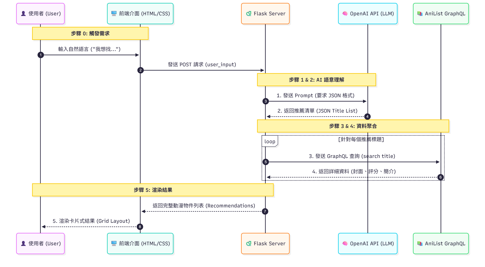

# AI 動漫推薦助手 (AI-Powered Anime Recommender)

## 專案簡介 (Introduction)

這個專案是一個基於人工智慧語意理解的互動式動漫推薦 Web 應用程式。它旨在解決傳統動漫資料庫搜尋的限制，讓使用者能夠以自然語言描述他們想看的動漫類型，而非僅限於關鍵字或標籤。透過整合 OpenAI 的強大語言模型和 AniList 的即時動漫資料庫，本系統能提供高度個人化且圖文並茂的推薦結果。

## 主要功能 (Features)

* **自然語言智慧推薦**：使用者可以輸入像聊天一樣的自然語言需求（例如：「我想看一部結局很感人但過程好笑的動漫」），AI 會理解並推薦相關作品。
* **AniList 資料整合**：即時從 AniList GraphQL API 獲取動漫的封面、評分、詳細簡介及官方連結。
* **首頁熱門推薦**：在未搜尋時，自動展示 AniList 的「目前趨勢 (Trending Now)」和「本季熱門 (Popular This Season)」動漫列表。
* **響應式介面**：介面設計簡潔，在不同裝置（桌面、平板、手機）上均能良好顯示。

## 使用技術 (Technology Stack)

* **後端框架**: Python Flask
* **AI 核心**: OpenAI API (GPT-3.5-turbo / GPT-4o)
* **資料來源**: AniList GraphQL API
* **前端**: HTML5, CSS3 (Flexbox/Grid), Jinja2 Template
* **套件管理**: `pip` (透過 `requirements.txt` 管理依賴)
* **環境變數**: `python-dotenv` (用於安全管理 API Keys)

## 如何運行專案 (Getting Started)

### 前置條件 (Prerequisites)

* Python 3.8+
* Git (用於克隆專案)
* OpenAI API Key (需自行申請)

### 安裝步驟 (Installation)

1.  **克隆專案庫 (Clone the repository)**
    ```bash
    git clone https://github.com/Yingwei1028/Flask-Web-OpenAI.git
    cd 你的專案名稱
    ```

2.  **建立並啟用虛擬環境 (Create and activate a virtual environment)**
    推薦使用虛擬環境來管理專案依賴，避免與系統其他 Python 專案衝突。
    ```bash
    python -m venv venv
    # macOS / Linux
    source venv/bin/activate
    # Windows
    .\venv\Scripts\activate
    ```

3.  **安裝依賴套件 (Install dependencies)**
    ```bash
    pip install -r requirements.txt
    ```

4.  **設定環境變數 (Set up environment variables)**
    為保護你的 API Key，請在專案根目錄創建一個名為 `.env` 的文件，並添加以下內容：
    ```
    OPENAI_API_KEY="你的_OpenAI_API_Key_貼在這裡"
    ```
    **重要**：請確保 `.env` 文件已加入 `.gitignore`，以免不小心將敏感資訊上傳到 GitHub。

5.  **運行 Flask 應用程式 (Run the Flask application)**
    ```bash
    python app.py
    ```
    應用程式將在 `http://127.0.0.1:5000/` 運行。在瀏覽器中打開此 URL 即可開始使用。

## 專案架構流程 (Project Architecture Flow)


1.  **使用者輸入**：使用者在前端輸入自然語言需求。
2.  **後端接收**：Flask Server 接收請求。
3.  **AI 處理 (OpenAI)**：Flask 將使用者輸入傳給 OpenAI API，請求推薦動漫標題列表（JSON 格式）。
4.  **資料聚合 (AniList)**：Flask 解析 AI 返回的標題，逐一向 AniList GraphQL API 查詢詳細資料（如封面、評分、簡介）。
5.  **結果渲染**：Flask 將聚合後的資料傳回前端，顯示為圖文並茂的卡片牆。

